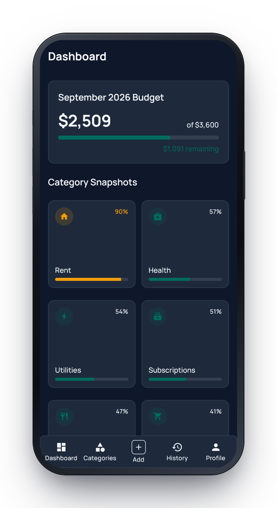
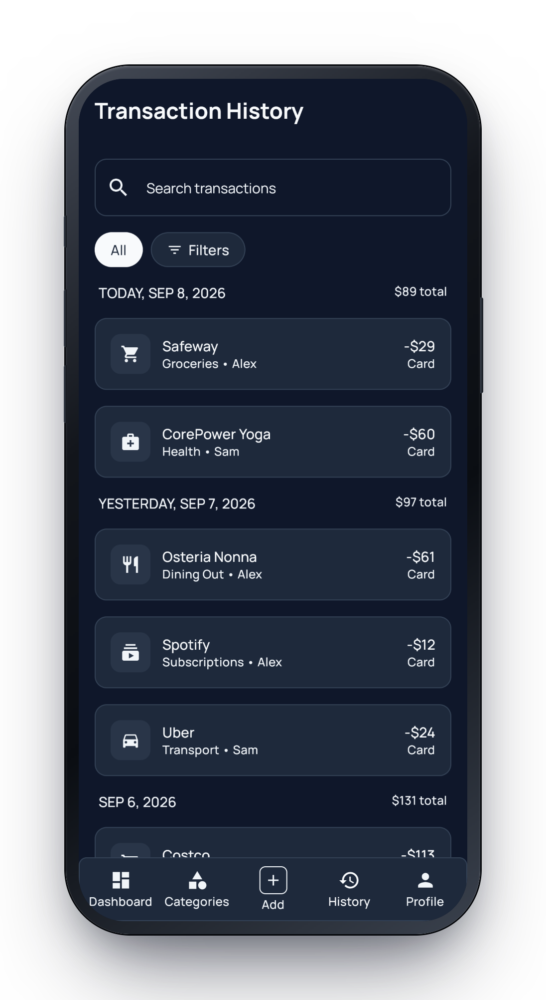
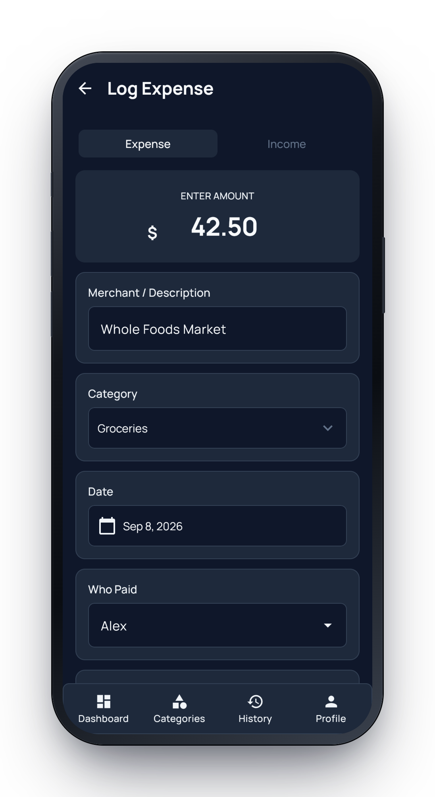
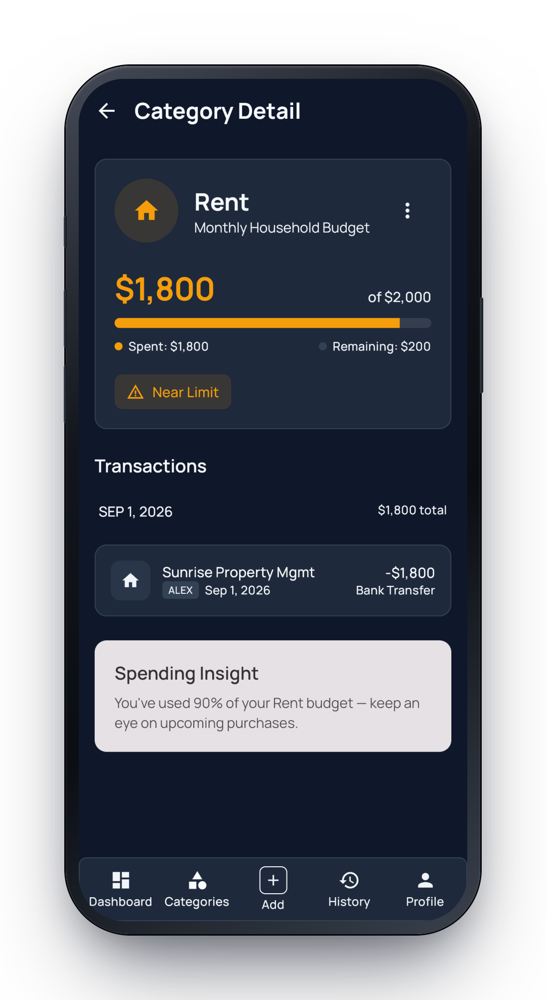
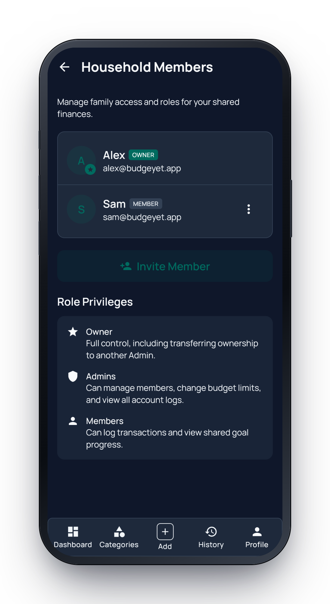
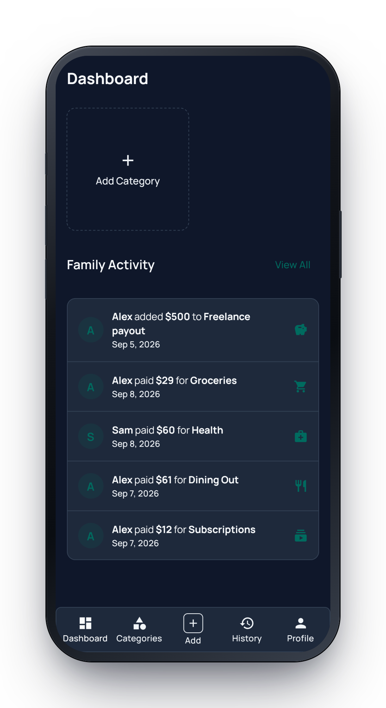
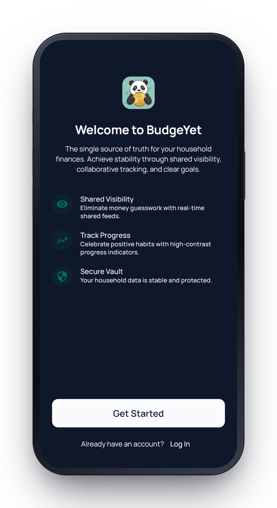
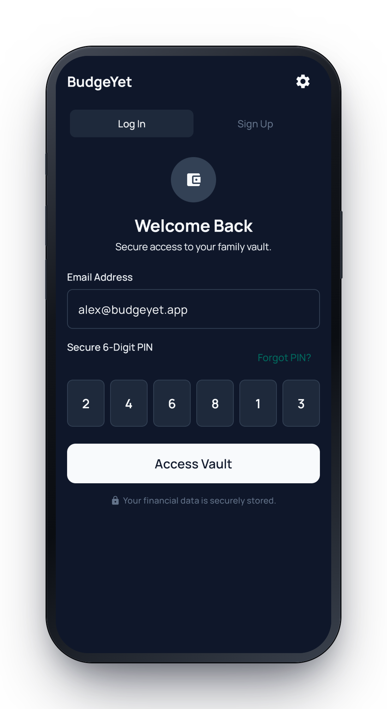
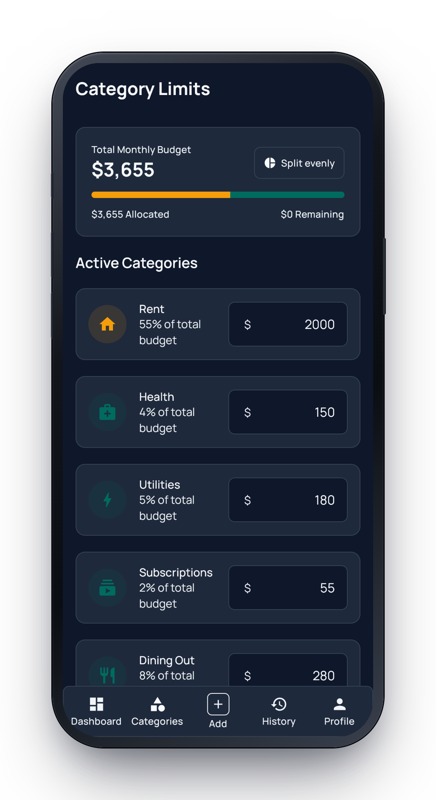
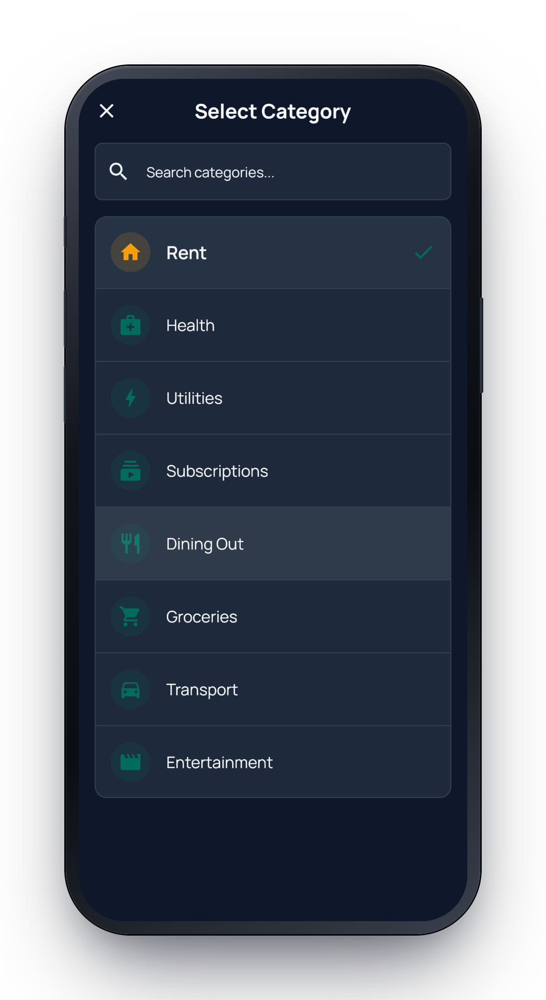

<div align="center">
  
  <h1>BudgeYet</h1>
  <p><b>The shared source of truth for your household's money</b></p>
  <p>
    Every member sees the same budget, the same transactions, and the same<br />
    real&#8209;time picture of where the money is going &mdash; no spreadsheets,
    no "who paid for what."
  </p>
  <p>
    <a href="https://github.com/nogoodusername/budge-yet/actions/workflows/backend-ci.yml"></a>
    <a href="https://github.com/nogoodusername/budge-yet/actions/workflows/frontend-ci.yml"></a>
    <a href="LICENSE"></a>
  </p>
  <p><b>Android &middot; iOS &middot; Web</b> &mdash; one Kotlin/Compose Multiplatform codebase,<br />backed by a self&#8209;hostable FastAPI service.</p>
  <table>
    <tr>
      <td></td>
      <td></td>
      <td></td>
    </tr>
  </table>
</div>

---

## Why BudgeYet

Household finance apps assume one person is "the budgeter." BudgeYet assumes a
household. It's built around three ideas:

- **Shared visibility by default.** One monthly budget per household, with
  categories and limits everyone can see. When your partner logs a $60 grocery
  run, it's on your dashboard before you get home.
- **Logging in under 10 seconds.** Amount, merchant, category, done. The whole
  app is built so the daily loop — open, log, glance — never gets in your way.
- **Yours to host.** The backend is a single FastAPI service you can stand up on
  any Linux box with one command. SQLite for a family; Postgres when you want it.

<div align="center">
<table>
  <tr>
    <td align="center"><br /><sub><b>Per‑category spend & insights</b></sub></td>
    <td align="center"><br /><sub><b>Roles: Owner, Admin, Member</b></sub></td>
    <td align="center"><br /><sub><b>Live household activity feed</b></sub></td>
  </tr>
</table>

<details>
<summary><b>More screens</b></summary>
<br />
<table>
  <tr>
    <td align="center"><br /><sub>Onboarding</sub></td>
    <td align="center"><br /><sub>Email + 6-digit PIN</sub></td>
    <td align="center"><br /><sub>Set category limits</sub></td>
    <td align="center"><br /><sub>Category picker</sub></td>
  </tr>
</table>
</details>

</div>

---

## Features

|  | |
|---|---|
| 🏠 **Households** | Create or join a household, invite members by email or link, transfer ownership, single monthly budget shared by everyone |
| 🗂️ **Categories & limits** | Preset and custom categories, per‑category monthly limits, "split evenly" helper, reassign‑before‑delete |
| 💸 **Fast transaction logging** | Expenses and income, merchant, payment mode, who paid, back‑dating; role‑scoped edit/delete |
| 📊 **Dashboard** | Spend‑vs‑budget gauge, category snapshots with on‑track / near‑limit / over‑budget states, spending insights |
| 🔎 **History & search** | Filter by category, payer, type, payment mode, date range, amount range; grouped by day with running totals |
| 👥 **Collaboration** | Owner / Admin / Member roles, polling activity feed of everyone's changes |
| 🔐 **Auth** | Email + user‑chosen 6‑digit PIN, JWT sessions, forgot‑PIN reissue, per‑account and per‑IP login throttling |
| 🌗 **Platform polish** | Dark theme, safe‑area aware, currency per household, Play‑compliant account deletion via a standalone web page |
| 🐳 **Self‑hosting** | One‑command installer, Docker Compose, Alembic migrations, health‑gated production deploy script |

> Deliberately out of scope for v1: push notifications, receipt OCR, savings goals,
> CSV/PDF export, and multiple budgets per household. See the
> [Product Requirements](docs/product-requirements.md) for the full picture and the
> [known gaps](AGENTS.md#known-gaps-deliberately-deferred-see-pr-discussion).

---

## Try it in one command (self‑host the backend)

On any fresh Linux/macOS server with `git`, `docker` (with Compose), and `python3`:

```bash
curl -fsSL https://raw.githubusercontent.com/nogoodusername/budge-yet/main/scripts/install.sh | bash
```

The installer clones the repo, walks you through **SQLite** (file‑based, simplest)
or **PostgreSQL** (bundled container, credentials generated for you), runs
migrations, and starts the API with Docker Compose. When it finishes, the API is
live at `:8000/docs`.

Point any BudgeYet client at your server from the app's **Backend Configuration**
screen. Fully unattended installs (Ansible, cloud‑init) are supported too — see
[**Deployment**](docs/deployment.md).

---

## Run it locally

<table>
<tr><th>Backend — FastAPI</th><th>Frontend — Compose Multiplatform</th></tr>
<tr valign="top"><td>

```bash
cd backend
uv run python scripts/setup_env.py sqlite
uv run alembic upgrade head
uv run uvicorn app.main:app --reload --port 8000
```

Swagger UI at <http://localhost:8000/docs>.

</td><td>

```bash
cd frontend
# Web (Kotlin/JS canvas) — http://localhost:8080
./gradlew :composeApp:jsBrowserDevelopmentRun
# Android
./gradlew :composeApp:installDebug
```

iOS: open `frontend/iosApp/iosApp.xcodeproj` in Xcode and Run.

</td></tr>
</table>

Full walkthrough, prerequisites, and troubleshooting: [**Getting Started**](docs/getting-started.md)
· device builds and sideloading: [**Running on Mobile**](docs/running-on-mobile.md).

---

## Architecture

```
                    ┌───────────────────────────────┐
                    │   Compose Multiplatform (KMP)  │
                    │   commonMain: UI · state · net │
                    └───────────────────────────────┘
                     Android  ·   iOS   ·  Web (JS/canvas)
                                    │
                         REST / JSON  (Ktor client)
                                    │
                    ┌───────────────────────────────┐
                    │      FastAPI  (Python 3.11+)   │
                    │  Router → Controller → Service │
                    │        → Repository            │
                    └───────────────────────────────┘
                                    │
                        SQLAlchemy 2.0 async ORM
                                    │
                     ┌──────────────┴──────────────┐
                     ▼                             ▼
              SQLite (aiosqlite)          PostgreSQL (asyncpg)
```

The frontend shares one Kotlin codebase across all three targets; the backend
follows strict Router → Controller → Service → Repository layering and stays
driver‑agnostic so the same code runs on SQLite or Postgres. Deep dive:
[**Architecture**](docs/architecture.md).

### Tech stack

| Layer | Choices |
|---|---|
| **Frontend** | Kotlin Multiplatform, Compose Multiplatform, Ktor client, kotlinx‑serialization, Material 3 |
| **Backend** | FastAPI, Pydantic v2, SQLAlchemy 2.0 (async), Alembic, `uv` |
| **Data** | SQLite or PostgreSQL |
| **Infra** | Docker Compose, nginx (TLS), Cloudflare Pages (web), Resend (email) |
| **CI** | GitHub Actions — path‑gated backend & frontend pipelines |

---

## Repository layout

```
budge-yet/
├── backend/        FastAPI service — app/, alembic/, tests/, Docker
├── frontend/       Compose Multiplatform — composeApp/ (common/android/ios/js), iosApp/
├── scripts/        install.sh (one‑command self‑host), version bump/sync
├── docs/           Getting started, deployment, architecture, PRD, releasing
└── .github/        Backend & frontend CI, Cloudflare Pages deploy
```

---

## Documentation

| Doc | What's in it |
|---|---|
| [Getting Started](docs/getting-started.md) | Local dev setup for both stacks, prerequisites, tests |
| [Deployment](docs/deployment.md) | One‑command installer, unattended installs, production (Compose + nginx) |
| [Running on Mobile](docs/running-on-mobile.md) | Android emulator/device, iOS via Xcode, SideStore sideloading |
| [Architecture](docs/architecture.md) | System design, backend layering, data model, CI/CD |
| [Product Requirements](docs/product-requirements.md) | Scope, personas, roles, business rules |
| [Releasing](docs/releasing.md) | Versioning scheme and the release flow |
| [Contributing](CONTRIBUTING.md) | How to propose changes, conventions, CI expectations |

Working in this repo with an AI agent? Start with [AGENTS.md](AGENTS.md).

---

## Contributing

Issues and pull requests are welcome. Backend and frontend have independent,
path‑gated CI — please run the relevant checks locally before opening a PR. See
[CONTRIBUTING.md](CONTRIBUTING.md) for conventions and the full checklist.

## License

[MIT](LICENSE) © BudgeYet contributors
